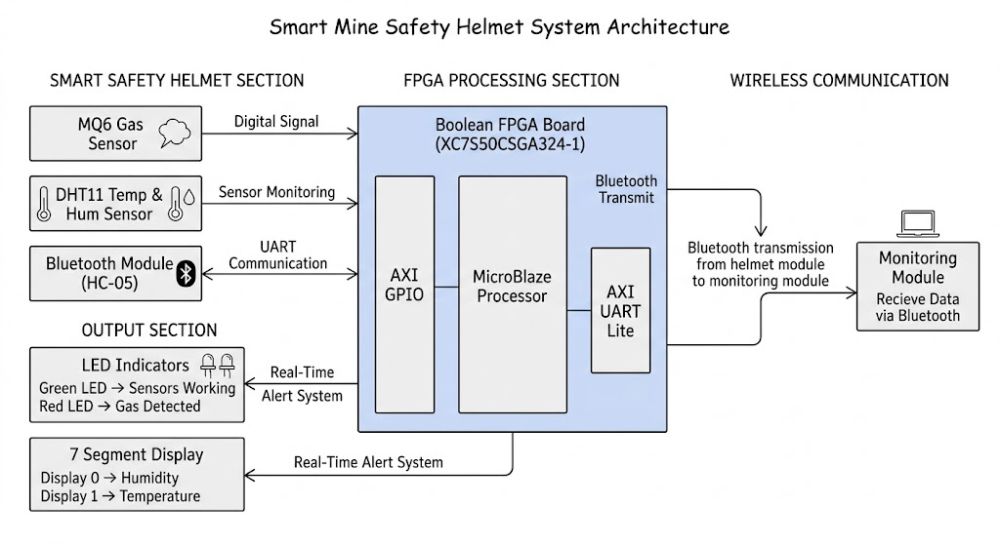
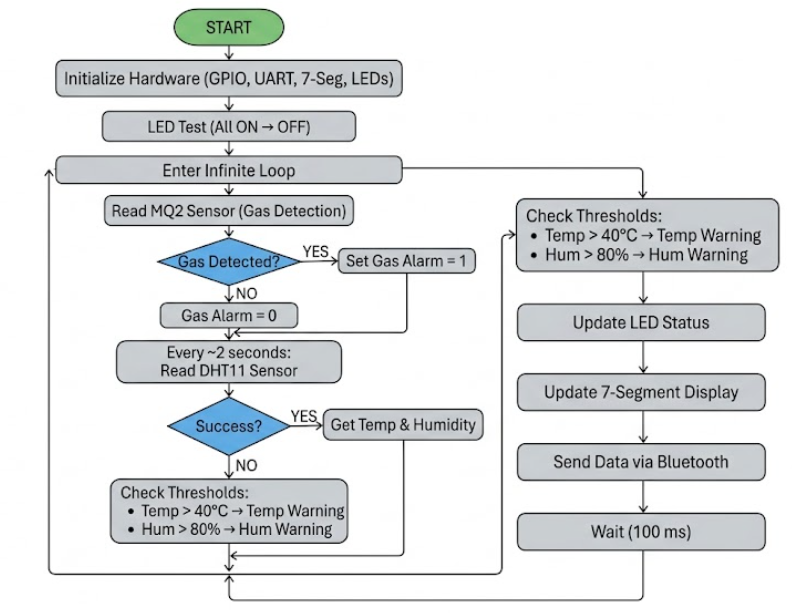

# SKILL LAB PRACTICAL HACKATHON

# Final Project README

> **Project Weight:** 100%  
> **Team Size:** 4 Students  
> **Project Duration:** 16 Hours  
> **Project Type:** FPGA-Based Embedded Industrial Safety System

---

# 1. Team Identity

## 1.1 Studio / Group Name

# MineGuards

---

## 1.2 Team Members

| Name | Primary Role | Secondary Role | Strengths Brought to the Project |
|---|---|---|---|
| Pranay Wani | FPGA RTL Design & Coding | FPGA Integration | Verilog HDL, FPGA Design, Debugging |
| Ashutosh Tiwari |  Hardware Integration | Testing | Sensor Integration, Hardware Assembly |
| Vedant Naik | Testing | FPGA Integration | UART & Bluetooth Communication |
| Sweety Saha | Documentation & Software Support | UI  | Technical Documentation |

---

## 1.3 Project Title

# FPGA-Based Smart Safety Helmet for Underground Mine Workers

---

## 1.4 One-Line Pitch

A real-time FPGA-based smart safety helmet capable of hazardous gas detection, environmental monitoring, and wireless alert transmission for underground mine worker safety.

---

## 1.5 Expanded Project Idea

Underground mining environments expose workers to hazardous gases, poor ventilation, high temperatures, and delayed emergency response situations. Existing safety systems are often centralized, expensive, and dependent on traditional microcontroller-based architectures.

To address these challenges, our project proposes an FPGA-based smart safety helmet using the Boolean FPGA Board XC7S50CSGA324-1. The system continuously monitors hazardous environmental conditions using an MQ2 gas sensor and a DHT11 temperature & humidity sensor.

The system is implemented using FPGA-based embedded architecture with MicroBlaze soft-core processing on the Boolean FPGA Board. Sensor data is processed in real time using Vivado and Vitis development tools. Environmental readings are displayed using onboard 7-segment displays while hazard alerts are indicated using LEDs. Simultaneously, live sensor data is transmitted wirelessly using UART communication through an HC-05 Bluetooth module.

The project demonstrates the application of FPGA technology in real-time industrial safety systems with improved reliability, parallel processing capability, and scalable embedded system design.

---

# 2. Inspiration

## 2.1 References

| Source Type | Title / Link | What Inspired You |
|---|---|---|
| Research Papers | Underground Mine Safety Monitoring Systems | Importance of industrial worker safety |
| Technical Tutorials | FPGA Sensor Interfacing Tutorials | FPGA-based embedded implementation |
| Sensor Datasheets | DHT11, MQ6, HC-05 Documentation | Communication and sensor protocols |
| Industrial Case Studies | Mining Accident Reports | Need for real-time hazard monitoring |

---

## 2.2 Original Twist

Unlike conventional microcontroller-based systems, this project utilizes FPGA-based embedded architecture with MicroBlaze integration for real-time sensor monitoring and communication.

The project combines hardware-level processing, UART communication, environmental monitoring, and display interfacing into a single FPGA platform, making the system faster, more scalable, and suitable for industrial safety applications.

---

# 3. Project Intent

## 3.1 User Journey

Before entering underground tunnels, a mining worker wears the smart safety helmet equipped with environmental sensors.

As the worker moves through mining areas, the MQ6 sensor continuously detects hazardous gases while the DHT11 sensor monitors surrounding temperature and humidity conditions.

The FPGA processes all incoming sensor data in real time. Environmental readings are displayed continuously through the onboard 7-segment displays.

If dangerous gas levels are detected, warning LEDs immediately activate to alert the worker. Simultaneously, environmental data and warning messages are transmitted wirelessly through Bluetooth communication to an external monitoring system.

This enables supervisors to monitor underground conditions remotely and respond quickly during emergency situations.

---

# 4. Definition of Success

## 4.1 Definition of “Usable”

The project is considered successful if it can reliably:

- Detect hazardous gas conditions
- Monitor temperature and humidity
- Display sensor values correctly
- Generate LED-based hazard alerts
- Transmit data wirelessly using Bluetooth
- Operate continuously on FPGA hardware

---

## 4.2 Minimum Usable Version

The minimum functional implementation includes:

- MQ6 gas sensor interfacing
- DHT11 sensor interfacing
- LED-based hazard indication
- UART Bluetooth communication
- FPGA hardware implementation

---

## 4.3 Stretch Features

Future improvements may include cloud connectivity, IoT dashboard integration, LoRa communication, GPS-based worker tracking, rechargeable battery systems, and AI-based predictive hazard monitoring.

---

# 5. System Overview

## 5.1 Project Type

- [x] Electronics-based
- [x] Sensor-based
- [x] App-connected
- [x] Light-based
- [x] Screen/UI-based
- [x] FPGA Embedded System
- [x] Industrial Safety Monitoring

---

## 5.2 High-Level System Description

The system receives input data from the MQ6 gas sensor and DHT11 sensor connected through PMOD GPIO pins of the FPGA board.

The MQ6 module provides threshold-based hazardous gas detection using its digital output pin. The DHT11 sensor communicates using a timing-based single-wire communication protocol.

The FPGA processes sensor data using MicroBlaze architecture and continuously updates outputs through LEDs and 7-segment displays.

Humidity values from the DHT11 sensor are displayed on 7-segment display 0, while temperature values are displayed on 7-segment display 1.

Environmental data is also transmitted wirelessly using UART communication through the HC-05 Bluetooth module.

The onboard LED strip indicates sensor status and hazard conditions. LEDs remain active during normal operation and blink during hazardous gas detection.

The system functions as a real-time industrial safety monitoring device for underground mining applications.

---

## 5.3 Input / Output Map

| System Part | Type | What It Does |
|---|---|---|
| MQ6 Gas Sensor | Input | Detects hazardous gases |
| DHT11 Sensor | Input | Monitors temperature & humidity |
| FPGA Board | Processing | Real-time data processing |
| LEDs | Output | Hazard indication |
| 7-Segment Displays | Output | Environmental data display |
| HC-05 Bluetooth Module | Output | Wireless UART communication |

---

# 6. System Design, Sketches and Visual Planning

## 6.1 Concept Architecture/sketch/schematic

  

## 6.2 Labeled Build Sketch/architecture/flow diagram/algorithm

The following diagrams represent the operational flow of the FPGA-based smart safety helmet monitoring system.
### System Flowchart

  

### Description

- The hardware architecture is implemented using a MicroBlaze-based embedded FPGA design on the Boolean FPGA Board.
- AXI GPIO peripherals interface the MQ6 gas sensor, DHT11 sensor, LEDs, and 7-segment displays.
- AXI UARTLite modules are used for Bluetooth-based UART communication through the HC-05 module.
- The operational flowchart illustrates initialization, environmental monitoring, hazard detection, display updating, and wireless data transmission.
- The system continuously monitors hazardous gas levels, temperature, and humidity conditions in real time for underground mine worker safety applications.

---

## 6.3 Approximate Dimensions

| Dimension | Value |
|---|---|
| Length | 20 cm |
| Width | 18 cm |
| Height | 12 cm |
| Estimated Weight | 500 g |

---

# 7. Electronics Planning

## 7.1 Electronics Used

| Component | Quantity | Purpose |
|---|---|---|
| Boolean FPGA Board XC7S50CSGA324-1 | 1 | Main processing unit |
| MQ6 Gas Sensor | 1 | Hazardous gas detection |
| DHT11 Sensor | 1 | Temperature & humidity monitoring |
| HC-05 Bluetooth Module | 1 | Wireless communication |
| LEDs | Multiple | Hazard indication |
| 7-Segment Displays | 2 | Environmental data display |
| Breadboard & Jumper Wires | Multiple | Circuit connections |

---

## 7.2 Wiring Plan

The MQ6 gas sensor and DHT11 sensor are connected to FPGA PMOD GPIO pins configured through Vivado constraints.

The sensors and communication modules are interfaced through PMOD A GPIO pins of the Boolean FPGA Board. GPIO connections include A14, B14, A13, and B13 for sensor and UART communication signals.

The HC-05 Bluetooth module communicates with the FPGA using UART TX/RX communication.

All components share a common ground and are powered directly from the FPGA board power supply.

---

## 7.3 Circuit Diagram/architecture diagram

The following block design represents the MicroBlaze-based FPGA architecture implemented in Vivado for sensor interfacing, UART communication, GPIO control, LED indication, and 7-segment display operation.

  

## 7.4 Power Plan

| Question | Response |
|---|---|
| Power Source | FPGA Board USB Power |
| Voltage Required | 3.3V / 5V |
| Current Concerns | Stable sensor operation |
| Safety Concerns | Avoid short circuits and loose wiring |

---

# 8. Software Planning

## 8.1 Software Tools

| Tool / Platform | Purpose |
|---|---|
| Verilog HDL | FPGA RTL Design |
| Vivado | Hardware Design & Bitstream Generation |
| MicroBlaze | Embedded Soft-Core Processor |
| Vitis | Embedded C Programming |
| UART Serial Monitor | Bluetooth Data Monitoring |

---

## 8.2 Software Logic/Algorithm

### Startup Behavior

The FPGA initializes GPIO peripherals, UART communication, LEDs, and display drivers during startup.

### Input Handling

Sensor data from MQ6 and DHT11 modules is continuously sampled through GPIO interfaces.

### Decision Logic

If hazardous gas concentration exceeds threshold limits, alert conditions are generated immediately.

### Output Behavior

Humidity values from the DHT11 sensor are displayed on 7-segment display 0, while temperature values are displayed on 7-segment display 1.

The onboard LED strip indicates system status and hazard conditions.

### Communication Logic

UART communication transmits real-time sensor data wirelessly through the HC-05 Bluetooth module.

### Reset Behavior

The system resets all outputs and returns to monitoring mode during restart conditions.

---

## 8.3 Code Flowchart

### Block Design Description

- MicroBlaze soft-core processor is used for embedded processing
- AXI GPIO modules interface LEDs, PMOD pins, and 7-segment displays
- AXI UARTLite modules handle Bluetooth UART communication
- Clocking Wizard generates the required FPGA clock
- Processor System Reset manages synchronized reset signals
- AXI SmartConnect enables communication between peripherals and MicroBlaze

The architecture enables real-time environmental monitoring and wireless communication for underground mine safety applications.

---
# 9. Bill of Materials

## 9.1 Full BOM

**Response:**  
`Not applicable currently. Final Bill of Materials with procurement details and specifications will be updated after complete hardware verification.`

---

## 9.2 Material Justification

FPGA technology was selected because of its real-time parallel processing capability and suitability for embedded industrial systems.

MQ2 and DHT11 sensors provide low-cost environmental monitoring while HC-05 enables simple UART-based wireless communication.

---

## 9.3 Items You Chose

| Item | Why Needed | Status |
|---|---|---|
| MQ6 Sensor | Hazard detection | Received |
| DHT11 Sensor | Environmental monitoring | Received |
| HC-05 Bluetooth Module | Wireless communication | Received |

---

## 9.4 Budget Summary

**Response:**  
`Not applicable currently because most components were available through laboratory inventory.`

---

## 9.5 Budget Reflection

The project minimizes overall implementation cost by utilizing low-cost sensors and existing FPGA development hardware.

---

# 10. Planning the Work

## 10.1 Team Working Agreement

Tasks are divided according to expertise in FPGA development, hardware integration, communication systems, testing, and documentation.

Progress is monitored through regular debugging and hardware validation sessions. Documentation is updated after each successful implementation phase.

---

## 10.2 Task Breakdown

| Task ID | Task | Owner | Status |
|---|---|---|---|
| T1 | System Architecture Design | Team | Completed |
| T2 | Sensor Interfacing | Ashutosh | Completed |
| T3 | UART & Bluetooth Integration | Vedant | Completed |
| T4 | FPGA Logic Design | Pranay | In Progress |
| T5 | Documentation & Reporting | Sweety | In Progress |

---

## 10.3 Responsibility Split

| Area | Main Owner | Support Owner |
|---|---|---|
| FPGA RTL Design | Pranay | Vedant |
| Electronics | Ashutosh | Team |
| Communication | Vedant | Pranay |
| Documentation | Sweety | Team |
| Testing | Team | Team |

---

# 11 Hour Milestones

## 11.1 8-Hour Plan

### Bi Hour 1 — Plan and De-risk

- System architecture finalized
- Sensor selection completed
- Hardware planning completed

### Bi Hour 2 — Build Subsystems

- Sensor interfacing tested
- UART communication verified
- FPGA GPIO setup completed

### Bi Hour 3 — Integrate

- Hardware integration completed
- Bluetooth communication tested
- Display system verified

### Bi Hour 4 — Refine and Finish

- Final debugging completed
- Documentation finalized
- System validation completed

---

## 11.2 Update Log

**Response:**  
`Not applicable currently. The implementation and testing log will be updated progressively during development stages.`

---

# 13. Risks and Unknowns

## 13.1 Risk Register

| Risk | Type | Likelihood | Impact | Mitigation Plan |
|---|---|---|---|---|
| Sensor Timing Errors | Technical | Medium | High | Debug using simulation |
| UART Communication Failure | Technical | Medium | Medium | Independent UART testing |
| FPGA Pin Mapping Errors | Technical | Medium | High | Constraint verification |

---

## 13.2 Biggest Unknown Right Now

The primary challenge is achieving stable real-time sensor interfacing while maintaining synchronized Bluetooth communication and display operation on FPGA hardware.

---

# 14. Testing

## 14.1 Technical Testing Plan

| What Needs Testing | How It Will Be Tested | Success Condition |
|---|---|---|
| UART Communication | Serial monitor testing | Correct wireless transmission |
| MQ6 Gas Detection | Hazard simulation | LED alert generation |
| DHT11 Sensor | Sensor value comparison | Accurate environmental readings |

---

## 14.2 Testing and Debugging Log

| Date | Problem Found | Result |
|---|---|---|
| 30 April | Bluetooth Range | Corrected |
| 2 May | Integration | Debugging completed |

---

## 14.3 Playtesting Notes

| Tester | What Worked Well | What Needs Improvement |
|---|---|---|
| Team Members | Real-time monitoring | Wireless communication range |

---

# 15. Build Documentation

## 15.1 Fabrication Process

The project was assembled using breadboard prototyping and FPGA PMOD interfacing techniques.

Hardware integration and debugging were performed incrementally to ensure stable sensor operation and communication reliability.

Vivado was used for hardware synthesis and bitstream generation while Vitis was used for embedded software development.

---

# 16. Build Photos

## Hardware Setup

The following image shows the complete hardware implementation of the FPGA-based smart safety helmet monitoring system including the Boolean FPGA board, MQ2 gas sensor, DHT11 sensor, Bluetooth module, and display interfacing connections.

  

### Hardware Demonstration

- Boolean FPGA Board used as the main processing unit
- MQ2 gas sensor connected for hazardous gas detection
- DHT11 sensor interfaced for temperature and humidity monitoring
- HC-05 Bluetooth module connected for UART wireless communication
- LEDs and 7-segment displays used for visual indication and monitoring

The hardware setup demonstrates successful integration of FPGA hardware, sensors, communication modules, and display peripherals for real-time industrial safety monitoring applications.

---

# 17. Final Outcome

## 17.1 Final Description

The final system successfully demonstrates an FPGA-based smart safety helmet capable of real-time hazardous gas detection, temperature and humidity monitoring, LED-based alert generation, 7-segment display interfacing, and wireless Bluetooth communication.

The system is implemented on the Boolean FPGA Board using Vivado, MicroBlaze, and Vitis. Environmental data is processed in real time and transmitted wirelessly through UART communication to external monitoring devices.

The project demonstrates the feasibility of FPGA-based industrial safety systems for underground mining applications.

---

## 17.2 What Works Well

- Real-time environmental monitoring
- FPGA-based processing
- UART Bluetooth communication
- LED hazard indication
- Sensor interfacing

---

## 17.3 What Still Needs Improvement

**Response:**  
`Currently under evaluation. Future improvements include wireless range optimization, compact PCB implementation, and cloud-based monitoring integration.`

---

## 17.4 What Changed From the Original Plan

Initially, the project focused only on hazardous gas monitoring. Later, environmental sensing, Bluetooth communication, and display systems were integrated to improve functionality and real-time monitoring capability.

---

# 18. Reflection

## 18.1 Team Reflection

The project improved our understanding of FPGA-based embedded systems, communication protocols, sensor interfacing, and industrial safety applications.

The team successfully collaborated across hardware, software, testing, and documentation domains to complete the system implementation.

---

## 18.2 Technical Reflection

The project provided practical experience in:

- FPGA architecture
- Verilog HDL
- Embedded C programming
- UART communication
- Sensor interfacing
- Vivado & Vitis workflow
- Real-time embedded debugging

---

## 18.3 Design Reflection

The project highlighted the importance of modular design, hardware planning, real-time processing, and iterative debugging during FPGA-based system development.

---

## 18.4 If You Had One More Hour

**Response:**  
`Additional development time would be utilized for developing a complete industrial monitoring UI/dashboard that can be fully integrated with the FPGA hardware system. A basic UI demo and concept design have already been prepared, and with additional time we would implement a proper real-time dashboard capable of displaying live sensor values, gas alerts, temperature, humidity status, and wireless monitoring data in a professional visualization interface.`

---

# 19. Final Submission Checklist

- [x] Team details completed
- [x] Project description completed
- [x] Inspiration sources included
- [x] Electronics planning documented
- [x] Task breakdown completed
- [x] Testing logs updated
- [x] Technical reflection written
- [x] Documentation finalized

---
